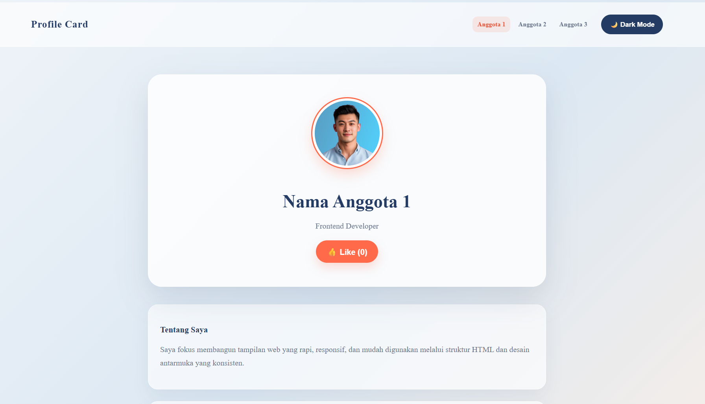

<!--
  TEMPLATE README PROJECT
  Copy isi file ini menjadi README.md di root repository kelompok,
  lalu isi setiap bagian di bawah ini.
→  

# [HIDUP JOKOWI]

Deskripsi singkat 1-2 kalimat tentang project ini (contoh: "DevCard adalah halaman kartu profil interaktif dengan fitur dark mode dan like counter, dibuat sebagai study case Workshop Git & GitHub.")

---

## Visualisasi

<!-- Tempel screenshot tampilan halaman di sini, atau link demo (misalnya GitHub Pages).-->



Live Demo: [https://christianvalentinos.github.io/githandson/](#)

---

## Tech Stack

- HTML5
- CSS3
- JavaScript (Vanilla)
- Git & GitHub

---

## Fitur Utama

- [ ] Toggle Dark Mode
- [ ] Like Counter interaktif
- [ ] Responsive layout
- [ ] _(tambahkan fitur lain sesuai pengembangan kelompok)_

---


## Contribution

| syududusyududu | Role | Kontribusi |
|---|---|---|
| Christian Valentino Setiawan | Project Initiator | Membuat repository, mengatur akses kolaborator, commit `index.html` |
| Leonel Shena Andreas | Styling Engineer | Membuat branch `styling`, menambahkan & menghubungkan `style.css` |
| Jazson Riddick | Script Engineer | Membuat branch `scripting`, menambahkan & menghubungkan `script.js` |


---

## How to Run

1. Clone repository ini:
   ```bash
   git clone <url-repo-kalian>
   ```
2. Buka folder hasil clone, lalu klik dua kali file `index.html` (atau klik kanan → Open with → Browser).

## Feature Improvement

Ide pengembangan lanjutan jika project ini dilanjutkan, misalnya:

- Menyimpan status like counter ke `localStorage`
- Menambahkan animasi transisi
- Membuat halaman menjadi responsive penuh untuk mobile
- Deploy otomatis via GitHub Actions ke GitHub Pages

